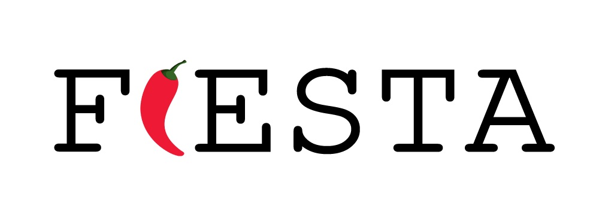

.. Fiesta documentation master file, created by
   sphinx-quickstart on Tue Feb 11 22:07:50 2020.
   You can adapt this file completely to your liking, but it should at least
   contain the root `toctree` directive.

###############################################################################
Welcome to Fiesta's documentation!
###############################################################################

Documentation for Fiesta

.. toctree::
    :maxdepth: 2
    :caption: Fiesta Documentation   
    :hidden:
    
    intro.rst
    buildguide.rst
    userguide.rst
    tutorials.rst
    devguide.rst
    techref.rst

