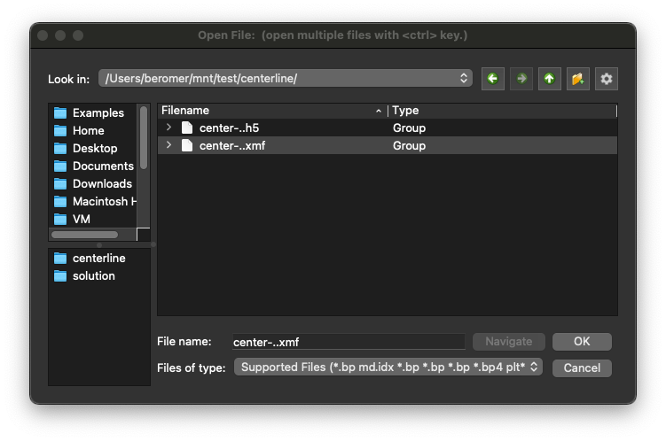
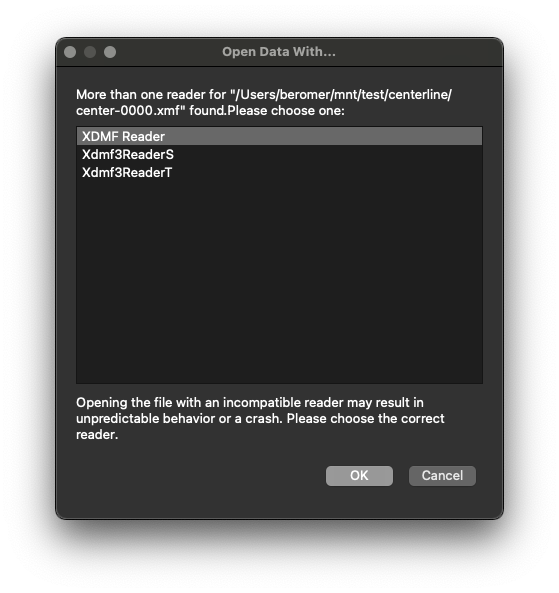
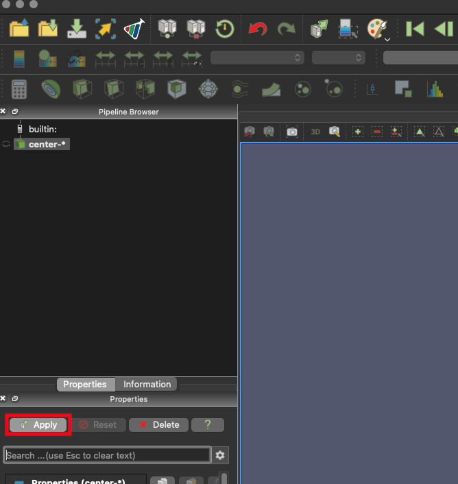
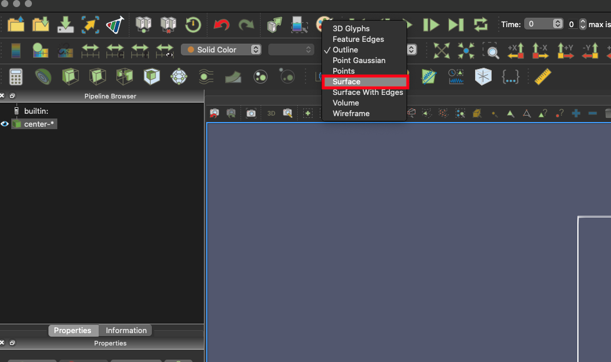
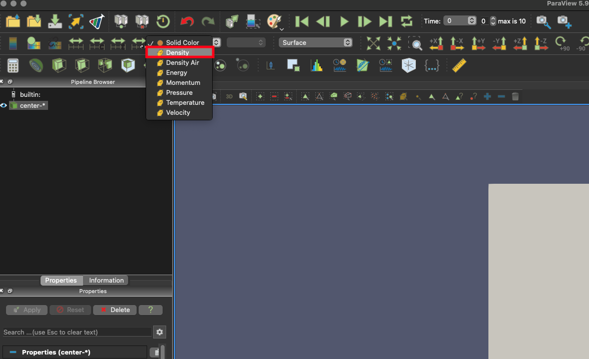
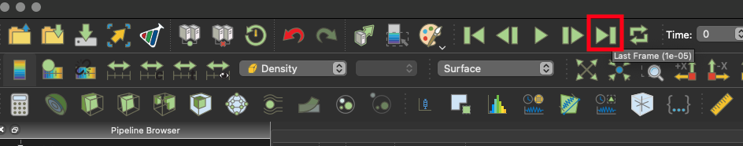
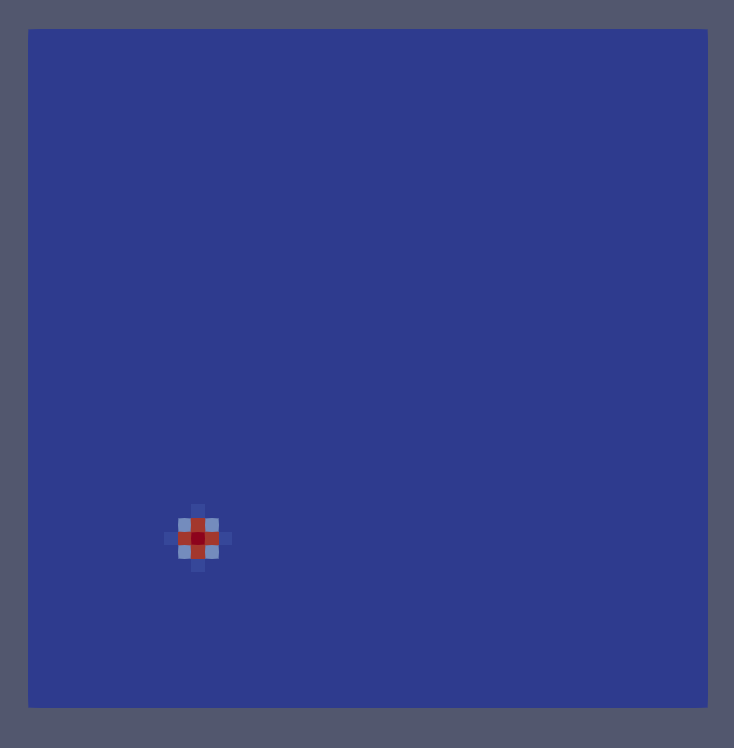

.. Fiesta documentation master file, created by
   sphinx-quickstart on Tue Feb 11 22:07:50 2020.
   You can adapt this file completely to your liking, but it should at least
   contain the root `toctree` directive.

###############################################################################
Tutorials
###############################################################################

*******************************************************************************
Tutorial 1: A 3D Expansion Problem on Xena
*******************************************************************************
The tutorial demonstrates several key steps in Fiesta usage:

* Building Fiesta

* Working with a sample input file

* Running a batch job

* Visualizing results

Problem Description
===============================================================================
The input file used below describes an expanding bubble of hot air 0.5m in
diameter at the center of a cubic box 10m on a side.  The hot air is initially
at 3000 Kelvin with a density of 1000 kg/m^3 while the surrounding air is at 300
Kelvin and 1kg/m^3.

Building Fiesta
===============================================================================
After logging into Xena, create a working directory, for example
/users/<username>/fiesta.

.. code-block:: bash

    mkdir fiesta
    cd fiesta

Now clone the Fiesta repository:

.. code-block:: bash

   git clone git@github.com:beromer/fiesta
   cd fiesta
   git checkout develop

Now create a build directory:

.. code-block:: bash

   cd ../
   mkdir build
   cd build

Now load the required modules:

.. code-block:: bash

   module load gcc/9.3.0-oxji
   module load openmpi/3.1.6-xgqr
   module load cuda/11.0.2-tyep
   module load cmake/3.18.2-tdkj

Now configure the build.  This should take about 1-2 minutes:

.. code-block:: bash

    cmake ../fiesta -DFiesta_CUDA=on -DFiesta_BUILD_ALL=on

Next, compile fiesta.  This could take up to 5 minutes:

.. code-block:: bash
    
    make -j

Modifying the Input File
===============================================================================

Now that Fiesta has been built, a sample problem can be run.

First, create a directory for running the test.

.. code-block:: bash

   cd ../ # now in /users/<username>/fiesta
   mkdir test
   cd test
   cp ../fiesta/samples/3D_Expansion/fiesta.lua .

Edit the input file to use the number of GPUs available on this system (2).
Change line 40 in `fiesta.lua` to using your preferred commandline editor.
::

    procs = {2,1,1}

Save the file and exit the text editor.  Make sure you are in the test
directory: :code:`/users/<username>/fiesta/test`.

Running Fiesta
===============================================================================

The simulation can now be run with a batch script.  In the test directory,
create a file named fiesta.slurm and insert the following:

.. code-block:: bash

    #! /bin/bash
    
    #SBATCH --job-name=fiesta
    #SBATCH --ntasks=2
    #SBATCH --time=00:30:00
    #SBATCH --partition=dualGPU
    #SBATCH --gpus=2
    
    module load gcc/9.3.0-oxji
    module load openmpi/3.1.6-xgqr
    module load cuda/11.0.2-tyep
    module load cmake/3.18.2-tdkj
    
    export OMPI_MCA_fs_ufs_lock_algorithm=1
    
    cd /users/beromer/fiesta/test
    mpirun -n 2 ../build/fiesta -n 2 -c -v 4

Now submit the job with the following command.

.. code-block:: bash

   sbatch fiesta.slurm

The job will be queued on the system and will be executed when the resources
become available. To check the status of the job, run the following command:

.. code-block:: bash

   squeue -u <username>

Output Products
-------------------------------------------------------------------------------
The file slurm-#####.out (where ##### is a job id assigned by Slurm) contains
log messages from Fiesta as well as log messages from Slurm itself.  If there
were any errors they will be reported in this file.  Fiesta was run with colors
enabled, so viewing this log file requires the following command :code:`less -R
slurm-#####.out`.  (To disable colors, remove the `-c` from the mpirun command
in the `fiesta.slurm` batch file.) Inspect this file to see log messages from
Fiesta including periodic status reports and timing information.

If the simulation completed sucessfully, there will also be three new
subdirectories, `centerline`, `restarts`, and `solution`.
The directory `centerline` contains files with `.xmf` and `.h5` extensions
numbered sequentially from 0000 to 1000 with a prefix `center-`.  These are
solution files pertaining to the "centerline" solution view described in the
input file.  These solution blocks contain data extracted from a plane through the
center of the domain. See the userguide for a description of solution view.

The directory `restarts` should be empty because restarts were not enabled for
this run.

The directory `solution` contains full resolution solution files for a view of
the entire domain.  These are also `.xmf` and `.h5` file pairs numbered from
0000 to 1000 with a prefix of "sol-".

Visualizing Results
===============================================================================
Solution file pairs (`xmf` and `h5`) can be used for visualization in
standard tools such as ParaView.  Paraview is not currently available on Xena,
so solution files must be downloaded to a local machine to be viewed in
Paraview.

The solution files for the centerline view are smaller in size than the files
for the full resoution soution view.  These files consume only 2.0MB and are
intended for faster visualization. Files can be downloaded with the Rsync
command.  To download the solution files for the centerline view, run the
following command from a local computer:

.. code-block:: bash

   rsync -Phavz --stats --info=progress2 <username>@xena.alliance.unm.edu:fiesta/test/centerline .

For Windows PowerShell without rsync support the following command can be used
instead:

.. code-block:: bash

   sch -r <username>@xena.alliance.unm.edu:fiesta/test/centerline .

Paraview 5.6 or later is required to view Fiesta output files. Paraview can be
obtained for free from `<https://www.paraview.org/download/>`_.  VisIt and
TecPlot are also supported.

From Paraview
open the `.xmf` file series in the centerline directory:

Choose the XDMF Reader from the "Open Data With..." dialog:

Click "Apply" to load the data:

Change the data representation to "surface":

Next select a variable to view from the variable dropdown:

Jump to the last data fram to see how the solution changes:

At this frame, the solution looks like the following:

Increase :code:`nt` variable in :code:`fiesta.lua` and rerun the simulation to
see how the solution evolves at later times.s
